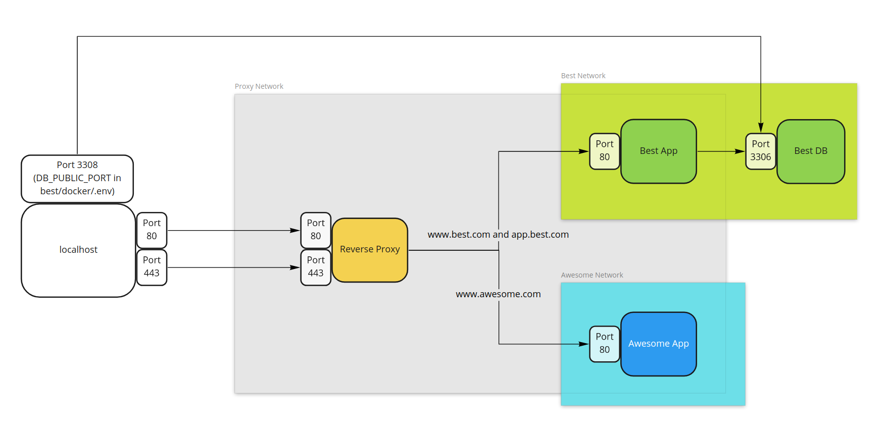
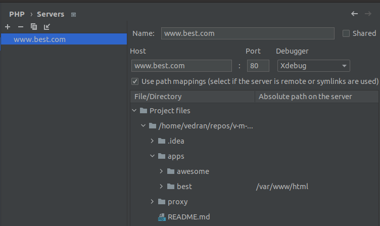

# Introduction

This repository is part of [The Easiest Way to Dockerize a PHP Application](https://vedran.tech/the-easiest-way-to-dockerize-a-php-application/) post.

## Applications

Two apps are `awesome` and `best`.
Every app has a `docker` directory and `.env` and `docker-compose.yml` files.

Awesome app is a simple app and Best app is a more complex app with almost every `docker-compose.yml` line explained.

[https://github.com/v-m-i/simple-php-app-dockerization/blob/main/apps/best/docker/docker-compose.yml](https://github.com/v-m-i/simple-php-app-dockerization/blob/main/apps/best/docker/docker-compose.yml)

[https://github.com/v-m-i/simple-php-app-dockerization/blob/main/apps/best/docker/.env](https://github.com/v-m-i/simple-php-app-dockerization/blob/main/apps/best/docker/.env)

### Disclaimer

1) When dockerizing a real-life app, you will probably want to add a `.htaccess` file in your Apache document root, but as `.htaccess` is unique per project, we won't cover setting that up.
2) This project might work slower on Mac, see [Docker on Mac - how to speed it up?](https://accesto.com/blog/docker-on-mac-how-to-speed-it-up/) for tips on how to improve performance.

## Proxy

Proxy has its certificates directory and `.env` and `docker-compose.yml` files.

[https://github.com/v-m-i/simple-php-app-dockerization/blob/main/proxy/docker-compose.yml](https://github.com/v-m-i/simple-php-app-dockerization/blob/main/proxy/docker-compose.yml)

[https://github.com/v-m-i/simple-php-app-dockerization/blob/main/proxy/.env](https://github.com/v-m-i/simple-php-app-dockerization/blob/main/proxy/.env)

# Setup

1. Add `127.0.0.1 www.best.com app.best.com www.awesome.com` to your hosts;
2. Run `./start.sh` (Ports 80 and 443 must be free);
3. Visit [www.best.com](www.best.com) or [app.best.com](app.best.com) or [www.awesome.com](www.awesome.com);
4. To stop, run `./stop.sh`.

# Debugging with Xdebug

Debugger is enabled only for the `best` app.

If you are using PhpStorm, see [Zero-configuration debugging](https://www.jetbrains.com/help/phpstorm/zero-configuration-debugging.html).

After listening is started in PhpStorm, go to `apps/best/docker` and run `docker-compose exec app php -d xdebug.start_with_request=yes public/index.php`.

When asked, set up server configuration like this:

